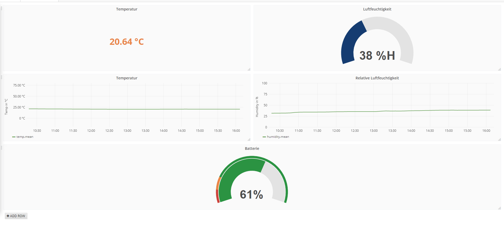

# Grafana installation & configuration (Ubuntu/Debian)
Visualization tool for data analysis and monitoring of e.g. sensor data
## Installation
### Step 1: Download and install dependencies
```bash
wget https://s3-us-west-2.amazonaws.com/grafana-releases/release/grafana_4.6.2_amd64.deb

sudo apt-get install -y adduser libfontconfig
```

### Step 2: Installation
```bash
sudo dpkg -i grafana_4.6.2_amd64.deb
```

### Step 3: Start server
```bash
sudo service grafana-server start
```
## Configuration

### Add database
1. Navigate to Data Sources
2. Add Data Sources
3. Enter all data, done!

### Assigning measurement to a graph
1. Add new graph to dashboard
2. Edit > Metrics
3. Panel Data Sources -> Select database
4. Add the right measurement in the select field

