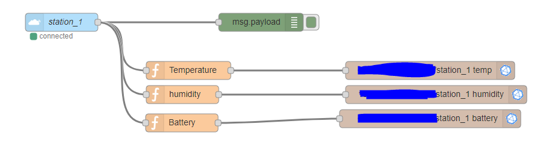
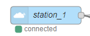
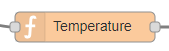
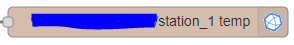

# Node-RED installation and configuration (Ubuntu/Debian)
## Installation
### Step 1: Download and install Node.js
```bash
curl -sL https://deb.nodesource.com/setup_9.x | sudo -E bash -

sudo apt-get install -y nodejs
```

### Step 2: Install Node-RED
```bash
sudo npm install -g --unsafe-perm node-red
```

### Step 3: Start server
```bash
node-red
```

##### Optional: start in screen
```bash
screen -d -m node-red
```
## Configuration

### Add TTN-Node


- Install TTN-Addon for Node-RED
```bash
cd $home /.node-red
npm install node-red-contrib-ttn
```
- AppID (Name of application)
- Region (eu, us, etc.)
- Access Key (See TTN-Console)
### JavaScript functions

- Example for temperature
  * Data with Bitshift back to unsigned 16int
  * Convert back to actual value
```
var message = {};
var temp16;
temp16 = (msg.payload[0] << 8) | msg.payload[1];
temp16 = (temp16 / 100) - 50;
message.payload = temp16;
return message;
```
### Influx Output Nodes


- Install Influx-Addon for Node-RED
```bash
cd $home /.node-red
npm install node-red-contrib-influxdb
```
- Add databa
- Output in particular InfluxDB measurement (Name of the value) -> pressure, temp, humidity


